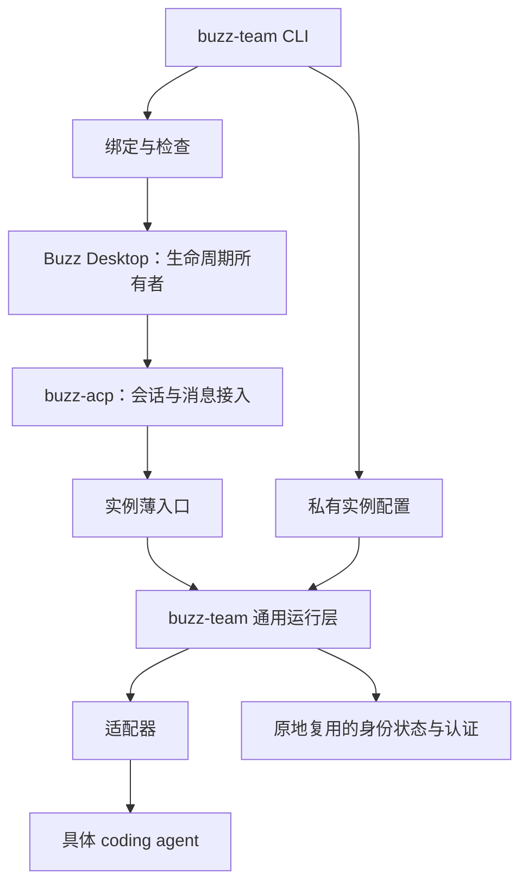

# 1 本机运行模块与实例迁移

状态：Approved（L1 已获用户会话批准；本文件落实批准范围）。

## 1 背景

[Issue #1](https://github.com/xforce-io/buzz-team/issues/1) 与该票 L1 评论定义范围。旧环境将执行逻辑、私有配置及路径绑定混合。本次分离代码与实例，不删除旧环境。

## 2 名词解释

使用 [名词表](../glossary.md)。实例配置不包含认证内容，只引用现有认证所在执行器目录。

## 3 目标与非目标

S1…S5 均须交付。多 coding-agent 通过明确适配器契约支持扩展，首个完整适配器是 Grok。通用 ACP 执行器可显式配置，但不能据此宣称某个未实测品牌已支持。非目标：新协作平台、后台调度器、认证迁移、自建 memory、删除旧环境。

## 4 能力

统一 CLI 提供 `init`、`doctor`、`status`、`prepare`、`bind`、`rollback`、`start`、`stop`、`workspace`、`diagnose`；内部执行入口 `launch` 与 `buzz` 支持 Desktop 包装器调用。JSON 输出仅暴露状态和明确允许的元数据，不转储环境变量/配置/进程命令行。错误非零，未知适配器失败关闭。

### 4.1 UI/UX

无新增 GUI。CLI 帮助解释 Desktop 生命周期归属；空实例返回初始化指引；缺失/冲突/不兼容返回非零且不绑定；成功显示检查结果与配置路径。Desktop 的身份、消息、线程、Activity 与异常反馈沿用现状。

## 5 思路与折衷

Python 标准库为运行基础，macOS Seatbelt 保留现有权限边界。平台无对应隔离能力则拒绝受限身份启动，不静默降级。实例读取外部配置，包装器引用已安装的模块，不拷贝实现源码。

认证硬约束：复用原执行器 home 的同一 auth 文件及既有 MCP 认证；不读取认证内容用于生成配置，不复制、不改写、不恢复旧版本、不重新登录。检查可比较文件身份/摘要，但不输出内容。认证由运行中的执行器正常刷新不属于迁移写入。现有会话和 Git 工作区原地保留，避免绝对路径与 Git 元数据失效。

切换仅在 Desktop 和 harness 停止后操作配置，先备份再原子替换；不得并行启动相同身份。回退恢复配置绑定而非运行数据。放弃全目录复制及全新认证方案。

改进策略：路径解耦、身份/版本/权限校验及迁移保护纳入本票。其余六类优化以明确状态及独立 Issue 交付；不得在“行为一致”迁移中暗改会话策略或技能集合。

## 6 架构

Desktop 通过实例 harness 入口启动接入桥，再由执行器入口启动 agent。每层继续继承既有身份、会话和授权参数。主路径：init/prepare → doctor → 停止 Desktop → bind → start → 客户端验证。失败路径：预检失败不写绑定；切换失败保留备份；客户端回归则 stop → rollback → start。启动/停止操作仅作用于实例指定 Desktop 应用，stop 要求操作者确认已无活跃任务。

## 7 模块

- 配置：版本与类型校验、绝对路径、身份一致性、适配器登记。
- 运行层：环境、权限、固定 cwd、任务工作区、薄入口。
- 适配器：执行器 home、专用环境、命令与能力；Grok 与通用 ACP 命令适配器。
- 实例迁移：只读转换、私有资源复制、绑定差异与回退。拒绝递归复制认证或运行状态。
- Desktop：库存对齐、进程检查、配置原子替换。
- 诊断：兼容、状态、路径和权限检查；输出不含秘密。

## 8 API/CLI

统一 `buzz-team --instance <目录> <命令>`，实例文件 `instance.local.json`，JSON 是沿用旧配置的明确选择，不再额外引入 TOML 配置解析分支。配置 v2：实例路径、state_root、protected_home、production、policies、repositories、agents、adapters、binaries、desktop、compatibility；真实值留本机。

适配器声明 `kind`、`command`、能力与专用环境设置。Grok 设置只存在于 Grok 适配器；通用 ACP 适配器显式提供 argv/env，不假设各执行器支持 skills/memory/session。配置不得注入通用运行层拥有的身份、cwd、权限与凭据环境变量。

`init --legacy <配置>` 创建新实例，不绑定客户端、不准备/改写旧身份状态。`prepare` 生成薄入口，不重置既有执行器配置。`bind` 需要进程停止及库存匹配，返回备份记录位置。`rollback --receipt <记录>` 只恢复本次变更且拒绝覆盖并发配置修改。`start/stop` 不直接启动 harness。

退出状态：0 成功；2 参数/配置/兼容/状态条件失败；子进程执行入口保留子进程退出语义。ACP stdout 必须纯协议，诊断写 stderr。

## 9 边界

配置不兼容、身份冲突、未知适配器、缺认证文件、缺必需二进制/权限能力、Desktop 未停止、非预期绑定均失败关闭。工作区名称和分支按仓库规则校验；拒绝已有目标覆盖。当前隔离是身份级，不宣称任务级强隔离或外部账号权限隔离。实例配置是可信管理输入，不接受 agent 动态修改权限。

## 10 迁移/兼容/回滚

旧目录保留。新实例含私有配置、说明与薄入口，不含 buzz-team 实现。历史状态和认证仍由原路径承载，迁移后不得依赖旧运维源码。私有项目配置/说明模板复制到新实例时限制权限，不复制 OAuth 或会话。旧 managed-agents 全量备份仅留私有目录；回退采用差异保护，拒绝覆盖切换后他人变更。源码构建标识如无法证明与二进制对应则标未知，不能用当前检出 SHA 冒充构建来源。

版本清单区分“观察到”“契约测试通过”“客户端验证通过”，未知不得自动升级为受支持。Desktop 0.5.23、Grok 1.0.34 的实际迁移组合须补桥接二进制指纹和真实验证记录。

## 11 测试计划

| 验收 | 功能文件 | 可判定结果 |
|---|---|---|
| S1 | `.agents/skills/verify-buzz-team/features/install.md` | 仓库外独立安装可运行；材料/兼容一致且不含私有数据 |
| S2 | `.agents/skills/verify-buzz-team/features/cli.md` | CLI 正常与失败路径、两个适配器契约及能力边界可观察 |
| S3 | `.agents/skills/verify-buzz-team/features/migration.md` | 新旧绑定差异受控、认证原地不写、失败保护与回退可验证 |
| S4 | `.agents/skills/verify-buzz-team/features/desktop.md` | 真实客户端消息、Activity、工具、权限、恢复/异常逐项通过 |
| S5 | `.agents/skills/verify-buzz-team/features/improvements.md` | 六类优化状态及关联完整 |

Integration：临时 Desktop 库存、原子写入/回退冲突、认证文件内容不变、子进程参数、环境、macOS 内核权限及端口拒绝。Unit：类型/路径/身份、适配器选择、DM 参数处理、秘密脱敏、配置转换。CI 在 Linux 跑跨平台契约测试；macOS 内核测试在本机运行，skip 不冒充通过。

## 12 开放问题

客户端基线验证中如发现当前系统已有异常，应单列并与迁移回归区分。审查为公开 CLI/权限表面变更，最终候选需要独立审查及人工批准。认证复用已获用户明确决定，无重新登录方案。

## 13 关联

- [Issue #1](https://github.com/xforce-io/buzz-team/issues/1)
- [L1](https://github.com/xforce-io/buzz-team/issues/1#issuecomment-5748407919)
