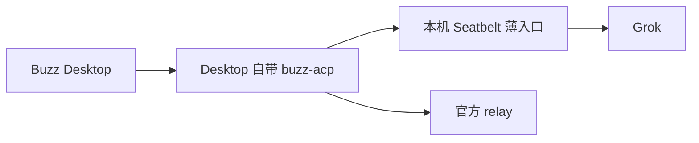

# #53 退出 ACP 中间层与重复运行状态

## 1 背景

Desktop 管理现役身份与 `buzz-acp`。仓库仍交付 ACP stdio 代理、唤醒门、任务会话映射、上下文账本和工作区命令；其中一些机制不在已观察到的在线消息路径上。目标与验收见 [Issue #53](https://github.com/xforce-io/buzz-team/issues/53)。

## 2 名词解释

沿用[名词表](../glossary.md)中的 Buzz、buzz-team、运行身份、权限策略和 ACP。本文的“薄入口”仅指设置本机环境与 Seatbelt 后执行 Grok 的进程入口，不承担 ACP 或任务协议。

## 3 目标与非目标

目标：九个现役身份由 Desktop 自带 `buzz-acp` 启动；开发与业务身份各自受 Seatbelt 约束；本地进程不解析 ACP、不保存 turn 或任务会话状态；退役能力从交付包和公开 CLI 消失。

非目标：新建任务守护进程、修补 Buzz 或 Grok、恢复上游已知的 Activity 降级、替其他任务系统实现工作区隔离。

## 4 能力

运行身份沿用现有 Grok home 与凭据。Desktop 负责身份、会话、作者准入和进程生命周期。薄入口只处理本机路径、必要环境与 Seatbelt；缺少沙箱、路径冲突或身份环境不完整时拒绝启动。旧命令的现役使用者需先迁移，之后才移除相应命令。

### 4.1 UI/UX

无新页面。用户在原线程收到回复；配置错误时该身份无法启动并能从启动日志看见原因。Desktop 原有身份编辑界面继续负责配置。

## 5 思路与折衷

保留单一上游 ACP 主路径。现役两类身份均需要本机沙箱，因此薄入口可以存在，但不得中继 stdio 消息。删除已退役状态和命令，比保留不可达代码更能降低升级维护。代价是历史 buzz-team CLI 调用须转到 Buzz 原生能力或任务所属系统；不为兼容旧命令保留代理层。

## 6 架构

正常路径：Desktop 配置确定身份、作者、会话和 ACP 入口；ACP 启动薄入口；薄入口施加身份策略并执行 Grok；消息和 Activity 由上游负责。失败路径：缺身份 home、缺 Seatbelt 或写路径冲突时入口以非零状态退出，Desktop 保持错误可见；按身份恢复原配置，不启动平行消费者。

## 7 模块

运行入口只保留路径、环境、Seatbelt 和 `exec`。退役 ACP 代理、任务唤醒、会话映射、上下文账本、工作区编排及未使用的通用执行器适配层。只读诊断和 Desktop 配置边界由 #54 收口。

## 8 API/CLI

交付包提供 `buzz-team-thin -- <grok agent 参数>`。在 Desktop 的 Agent harness 下登记该命令为自定义执行器，ACP command 仍为 Desktop 自带 `buzz-acp`；这是 Desktop 的原生配置入口，不能把薄入口误登记为 ACP command。入口仅原样传递 Grok 参数和 stdio。Desktop 为每个身份设置既有 `GROK_HOME`、`GROK_ACP_CWD`，并增加 `BUZZ_TEAM_POLICY_PATH`，指向本机私有策略文件。策略文件只含版本、期望的 Grok home、Grok 可执行文件本机绝对路径、策略类型（development/business）和可写路径；不含公钥、relay、凭据或会话。策略文件与执行文件不得位于允许写入的根下。缺任一必需项时拒绝启动。

交付包不再提供 `wake`、`session`、`context`、`workspace` 及其状态文件的读写契约。启动入口不消费任务 ID、频道帖内容或 ACP 事件。官方 Buzz CLI 的使用和其本地包装命令在 #54 处理。

## 9 边界

本机策略不得覆写 Buzz 身份、凭据、作者和会话配置。入口对输入路径做显式校验，缺 Seatbelt 时拒绝以无沙箱模式运行；不得尝试在已受未知沙箱约束的父进程下静默放宽权限。历史数据和凭据不因代码退役而删除。

## 10 迁移/兼容/回滚

先记录九个身份的实际进程链及旧 CLI 真实消费者，再迁移一个身份验证，之后按身份推进。旧命令消费者确认去向前不删除入口；旧状态只停止使用并保留备份。异常时仅恢复该身份的 Desktop 配置和上一个已知可用的入口；不复制或重写认证文件。

## 11 测试计划

- E2E：S1 对应 `.agents/skills/verify-buzz-team/features/runtime-inventory.md`，核对九个身份及旧命令消费者；S2 对应 `features/thin-runtime.md`，经真实 Desktop 检查回复、Activity 和沙箱正反例；S3 对应 `features/retired-runtime.md`，用非 editable 安装包和当前文档确认退役入口消失。
- Integration：核对 home 继承、沙箱内进程退出码、身份级回退。
- Unit：核对路径校验、缺 Seatbelt 和环境冲突时拒启。

## 12 开放问题

Desktop 的 Agent harness 可登记自定义执行器，而 ACP command 独立选择。九个现役身份的实际 Grok 启动来源和该入口的兼容性须在 S1/S2 实测，不能只凭 `managed-agents.json` 字段判断。

## 13 关联

[#47](https://github.com/xforce-io/buzz-team/issues/47)、[#48](https://github.com/xforce-io/buzz-team/issues/48)、[#54](https://github.com/xforce-io/buzz-team/issues/54)、[#24](https://github.com/xforce-io/buzz-team/issues/24)。
