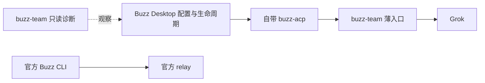

# #54 官方组件升级不依赖 buzz-team 改版

## 1 背景

现有包内兼容清单、实例摘要、Desktop 私有库存写入及 Buzz CLI 参数改写，让上游正常升级变成本仓库发布。目标与验收见 [Issue #54](https://github.com/xforce-io/buzz-team/issues/54)，运行层边界由 [#53](53-remove-acp-middle-layer.md) 确定。

## 2 名词解释

沿用[名词表](../glossary.md)的 Buzz、buzz-team、桌面库存与薄入口。官方版本和镜像 digest 是部署记录，不是本地运行门禁。

## 3 目标与非目标

目标：Desktop 独占身份、凭据、生命周期和原生配置；buzz-team 只保留本机路径、Seatbelt 与必要只读诊断；官方组件正常升级不修改、重装或重绑 buzz-team。

非目标：放弃记录实际版本；承诺上游破坏公开契约时自动兼容；将 Desktop 私有库存文件视为稳定配置 API；维护 Buzz CLI 兼容代理。

## 4 能力

运行入口不检查官方组件包内 SHA。只读诊断在可识别库存中发现重复身份时报告异常；遇到未知结构时报告“无法核对”，不得误报健康或写回。消息操作由官方 Buzz CLI 直接完成。

### 4.1 UI/UX

无新页面。运维者在 Desktop 原生界面维护身份和会话。诊断结果明确区分异常、无法核对与已检查；升级记录说明实际版本和回退点。

## 5 思路与折衷

把事实源收敛到 Desktop 和官方 CLI，可删除跟随其内部格式变化的本地代码。代价是 buzz-team 无法再从私有库存自动重建完整身份；故障恢复依赖 Desktop 自身配置与备份。仅在明确可解析时检查库存，不猜测未知结构。

## 6 架构

主路径：官方渠道升级组件，Desktop 沿用身份配置，薄入口按本机路径与 Seatbelt 执行，官方 CLI 收发消息。失败路径：上游破坏公开契约时回退该组件并向上游反馈；库存未知时诊断报告无法核对，停止基于该检查的健康断言。

## 7 模块

删除包内兼容清单、版本摘要门禁、Desktop 私有库存写入和官方 CLI 包装；只读诊断只依赖可观察状态。删除已无职责的启停、绑定和回滚命令。历史部署证据保留为历史材料，不参与启动判定。

## 8 API/CLI

公开 `buzz-team doctor` 只返回只读诊断；薄入口契约见 #53。消息收发使用上游 `buzz` 命令，参数遵循上游版本，不通过 buzz-team 翻译。Desktop 原生界面负责配置和生命周期。

## 9 边界

诊断不得写 `managed-agents.json`，不得保存完整身份定义或凭据。当前实例只保留薄入口所需的本机路径与 Seatbelt 策略。不能把版本核对失败等同于实际功能失败，也不能把不可解析库存报为通过。

## 10 迁移/兼容/回滚

先核对九个现役身份和旧命令消费者；保留现有 Desktop 与实例备份。#53 的运行链路验证通过后，移除写入/改写入口。升级各组件时记录前后版本、digest 和官方回退方式；失败时回退上游组件或受影响身份，而非恢复本地 fork。

## 11 测试计划

- E2E：S1 在官方 Desktop/Grok 和 relay 各一次版本变化后核对零本地改版；S2 核对 9/9 身份事实源和诊断三态；S3 用官方 CLI 验证频道及 DM；S4 从交付包、现行文档与一次启动验证轻量化边界。
- Integration：非 editable 安装包中没有退役命令/模块，doctor 对已知重复和未知库存分别给出异常与无法核对。
- Unit：诊断解析和错误映射；薄入口路径规则由 #53 覆盖。

## 12 开放问题

官方渠道是否在当前时间窗口提供可受控回退的 Desktop/Grok 与 relay 新版本，须在 S1 变更前确认。若无真实版本变化，S1 不得仅用模拟版本宣称通过。

## 13 关联

[#44](https://github.com/xforce-io/buzz-team/issues/44)、[#46](https://github.com/xforce-io/buzz-team/issues/46)、[#47](https://github.com/xforce-io/buzz-team/issues/47)、[#48](https://github.com/xforce-io/buzz-team/issues/48)、[#53](https://github.com/xforce-io/buzz-team/issues/53)。
